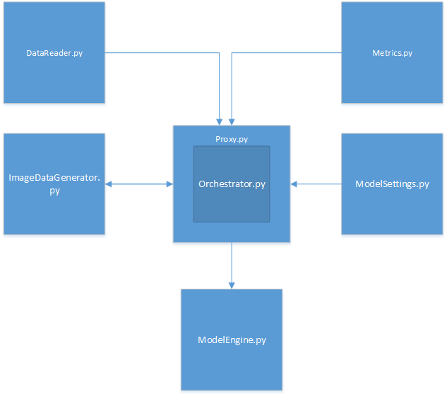

# First Impression Mapping

## Overview

The following document describes the project from a technical perspective outlining intentions, design decisions, and preliminary results. 

## Technical Design

The following is an overall class flow denoting how each class is used. Each relevant class will be descibed in detail below. 

### DataReader

The data reader is a non-generic, dataset specific reader that reads the data from a given input file. The datasets should be in the working directory of the project for the images to be found. 

### ImageDataGenerator

The image data generator inherits from Keras.utils.Sequence to override data generation. For this, __getItem__ is used to shuffle image indexes to use, retrieve the images per each index value, and return the 
data and its corresponding labels. Currently, upon each generation for each image, the image is scaled down. This is to normalize the iamge dimensions between the datasets and is currently (218, 178). Using this image generation process lets us enable multiprocessing while the modeling is running. 

### Metrics

Metrics is a custom callback designed to help calculate the accuracy on the KDEF dataset. Currently it is calculating mean distance element wise over the dataset. 

### Model Engine

The model engine is the object that is instantiating and running TF models. Currently, the main model is defined by 4 Conv2D layers with Maxpooling2D layers following. The loss, metrics, and optimizers are defined in the model settings below. After Celeb A has trained, the engine then converts the same model used for Celeb A into a model that can be consumed for fine-tuning KDEF. 

### Model Settings

The model settings class is a static placeholder for all the model specific settings needing to be used. The values for each model are given below. 

'kdef_params = { 
                'dimension': (218, 178),
                'batch_size': 8, 
                'n_classes': 3,
                'n_channels': 3,
                'shuffle': True,
                'labelDataType': float,
                'lossType': keras.losses.mean_squared_error,
                'learningRate': 0.0005, 
                'output_activation': None,
                'weight_path': "./weights.h5",
                'number_of_epochs': 100,
                }

celeba_params = { 
                    'dimension': (218,178),
                    'batch_size': 64, 
                    'n_classes': 40,
                    'n_channels': 3,
                    'shuffle': True,
                    'labelDataType': bool,    
                    'lossType': keras.losses.binary_crossentropy,
                    'learningRate': 0.001, 
                    'output_activation': keras.activations.sigmoid,
                    'weight_path': "./weights.h5",
                    'number_of_epochs': 200,
                }'
                

### Orchestrator

The orchestration class organizes and runs the above classes accordingly. Most calls are made through a proxy which allows for logging calls to be posted to the terminal as well as made in /logs. Additional functionality can be implemented into the proxy as needed. Weights are outputed to weights.h5 from the Celeb A model. 

## Data Analysis 

## Preliminary results